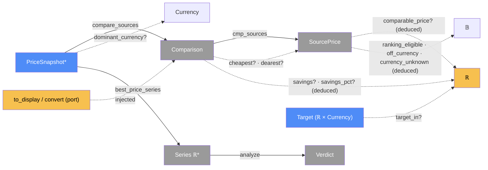

# Analysis — categorical model

> Model-first (FRAMEWORK §2/§4). Intended specification for this component. The
> code realises it (see IMPLEMENTATION.md). Source of record: `app/analysis.py`.

## 1. Overview
Pure functions that answer the app's two questions, which are kept separate.
**Where is it cheapest right now?** (`compare_sources`). **Is now a good time to
buy?** (`analyze`, run on the best-price-over-time series). It does no I/O:
currency conversion comes in as a callable.

## 2. Why
Almost everything here is **deduced**. `SourcePrice`, `Comparison`, the price
series and the `Verdict` are all views over stored snapshots and are never
persisted. Writing that down makes the currency rules (invariants 4 and 5) into
composition rules on *which arrows are defined*: a price with no comparable
currency has no `comparable_price`, rather than a wrong one. Taking conversion as
a **port** (a callable) is the hexagonal shape from §7.4. It keeps these tests
offline and deterministic.

## 3. Core category

## 4. Morphism table
| Morphism | Signature | Partiality | Semantics |
| --- | --- | --- | --- |
| `compare_sources` | `Source* × Latest × Currency? × ToDisplay? → Comparison` | Total | side-by-side view of each listing's latest price |
| `cmp_sources` | `Comparison → SourcePrice*` | Total | every listing, including failed and uncomparable ones |
| `cheapest?`, `dearest?` | `Comparison → SourcePrice` | Partial | only over ranking-eligible listings |
| `comparable_price?` | `SourcePrice → ℝ` | Deduced, partial | defined iff `ranking_eligible`: the converted price if converting, else the quoted one |
| `ranking_eligible` | `SourcePrice → 𝔹` | Deduced | a known currency ∧ (converted ∨ equal to the comparison currency) |
| `off_currency`, `currency_unknown` | `SourcePrice → 𝔹` | Deduced | why a listing isn't ranked |
| `savings?`, `savings_pct?` | `Comparison → ℝ` | Deduced | `dearest − cheapest`, in the comparison currency |
| `best_price_series` | `PriceSnapshot* × Currency? × ToDisplay? → ℝ*` | Total | the minimum per hour bucket over comparable snapshots |
| `analyze` | `ℝ* × ℝ? → Verdict` | Total | BUY_NOW / WAIT / NEUTRAL / NOT_ENOUGH_DATA / NO_DATA |
| `target_in?` | `ℝ? × Currency? × Currency? × Convert → ℝ` | Partial | the target restated in the history's currency. None ⇒ don't apply it |
| `dominant_currency?` | `PriceSnapshot* → Currency` | Partial | the most common known currency |

## 5. Functors
**Verdict state machine.** `analyze` maps a series and a target into the discrete
category `{NO_DATA, NOT_ENOUGH_DATA, NEUTRAL, BUY_NOW, WAIT}`. It checks in fixed
precedence: target met → BUY_NOW; fewer than 3 points → NOT_ENOUGH_DATA; a flat
series → NEUTRAL; otherwise by percentile (≤25 BUY_NOW, ≥75 WAIT).

## 6. Composition rules
1. **Never rank different currencies by magnitude** (invariant 4). `cheapest?`
   ranges only over `ranking_eligible` listings. Unknown currencies are never
   eligible.
2. **Target and history share one currency** (invariant 5): `analyze(series,
   target_in(target, target_currency, history_currency))`, where
   `history_currency = display_currency ∨ primary_currency`.
3. **Deduce, don't store:** nothing in this component is persisted. Every view is
   recomputed from snapshots on each request.
4. **Conversion enters as a port.** This module never imports `fx`.
   `to_display : ℝ × Currency → ℝ?` and `convert : ℝ × Currency × Currency → ℝ?`
   are injected.
5. **Converted history uses today's rate** for every snapshot. That's a documented
   limitation (it keeps the series' shape within one currency).

## 7. Atoms owned (FRAMEWORK §4)
**Trn**: the rows of §4, all pure.
**Loc**: collapsed. It runs in `ServerProc` on whatever thread builds the view
(the §7.1 degenerate case: `Dat + Alg`).
**Trm**: none.

## 8. Bridges to other components (ports)
| Boundary morphism | Signature | Stored? | Semantics |
| --- | --- | --- | --- |
| `to_display` port | `ℝ × Currency → ℝ?` | — | realised by `fx.make_converter`, and by a fake in tests |
| `convert` port | `ℝ × Currency × Currency → ℝ?` | — | realised by `fx.convert`, and by a fake in tests |
| `views_out` | `analysis → web` | — | `Comparison`, series and `Verdict` feed the templates |

## 9. Coherence notes
- **§7.4 hexagonal:** `behaviour(analysis)` is invariant under which converter is
  plugged in. The tests glue in a fake, and the app glues in `fx`.
