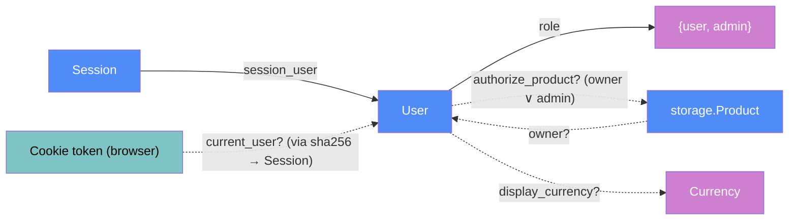

# Auth — categorical model

> Model-first (FRAMEWORK §2/§4). Intended specification for this component. The
> code realises it (see IMPLEMENTATION.md). Source of record: `app/auth.py`,
> `app/account.py`, `app/admin.py` (the user-management routes).

## 1. Overview
Accounts and who may do what. People register and sign in with a username and
password. There are two roles: `user` (the default) and `admin`. The first
account ever registered is the admin. Each user's products are private to them,
admins can open any product, and an admin page manages accounts.

## 2. Why
The §3 check decides the shape. An "admin" has exactly a `User`'s morphisms plus
extra *capabilities*, not extra data, so it's one `User` object with a `role`
discriminator, not an admins table. `Session` isn't part of `User`: it's a
genuine one-to-many relation with its own expiry. Writing ownership as a partial
morphism (`owner? : Product → User`) makes "someone else's product" one precise
rule, `authorize_product?`, which every route goes through. It isn't a check
repeated per route.

## 3. Core category

## 4. Morphism table
| Morphism | Signature | Partiality | Semantics |
| --- | --- | --- | --- |
| `role` | `User → {user, admin}` | Total | the discriminator (§3). The first user is `admin` |
| `session_user` | `Session → User` | Total | cascade-deleted with the user |
| `owner?` | `Product → User` | Partial | NULL = from before accounts; the first admin claims those |
| `current_user?` | `Cookie → User` | Partial | a valid, unexpired session of an enabled user |
| `authorize_product?` | `User × ProductId → Product` | Partial | defined iff owner = user or user is an admin. Otherwise 404, the same as a missing id |
| `display_currency?` | `User → Currency` | Partial | personal preference. Absent means the site default (`settings`) |
| `login?` | `Username × Password → Session` ⊸ | Partial | undefined on a wrong password, unknown user, disabled account or throttle; one message for the first two |
| `register` | `Username × Password → User` ⊸ | Partial | refused on a taken name (case-insensitive) or a bad length or characters |

## 6. Composition rules
1. **The first account is the admin,** and it claims every unowned product.
   It's atomic (`BEGIN IMMEDIATE`), so two first sign-ups can't both win.
2. **At least one enabled admin always exists.** Demote, disable and delete are
   refused when they'd remove the last one. Enforced in `auth`, so every route
   inherits it.
3. **Passwords are never stored.** Only salted scrypt with its parameters is
   kept, and verification is constant-time.
4. **Sessions are opaque and hashed at rest.** The raw token exists only in the
   browser cookie (HttpOnly, SameSite=Lax). Disable and delete end all of a user's
   sessions.
5. **One failure message.** A wrong password and an unknown user look the same,
   and an unknown user still costs one scrypt.
6. **Throttle:** 5 failures per username in 15 min locks it for 15 min. It's held
   in memory.
7. **Every product and source route goes through `authorize_product?`** (or
   `source_for`). There are no per-route ad-hoc checks.
8. **Redirect targets from requests are same-site paths only** (`local_path`).

## 7. Atoms owned (FRAMEWORK §4)
**Trn**
| `Trn` | `t_from → t_to` | Realising code |
| --- | --- | --- |
| `hash_password` / `verify_password` | `𝕊 → Hash`, `𝕊 × Hash → 𝔹` | `auth.hash_password`, `auth.verify_password` |
| `register` | `Username × Password → User` ⊸ | `auth.register` → `database.create_user` |
| `authenticate` | `Username × Password → User` | `auth.authenticate` |
| `start_session` / `user_for_token` / `end_session` | sessions | `auth.*` |
| `require_user` / `require_admin` | `Request → User` (or redirect / 403) | `auth.*` |
| `product_for` / `source_for` | `User × Id → Row` | `auth.*` |
| `change_role` / `set_disabled` / `delete_account` | admin actions | `auth.*` |

**Loc**: `ServerProc` (request threads) and `SQLite` (`users`, `sessions`).
`UserBrowser` holds the cookie.
**Trm**: `t_cookie : UserBrowser → ServerProc`, carrying the raw session token on
every request (HttpOnly, SameSite=Lax). The cross-site POST guard sits on this
channel: a request whose Origin or Referer names another host is refused.
**Placements (§4.2)**: the session exists in **two `DataLoc`s in deliberately
different forms**: raw in the browser, `sha256` in SQLite. The username rules are
placed twice: the HTML `pattern` in the browser, and `username_problem` on the
server, which is the authority.

## 8. Bridges to other components (ports)
| Boundary morphism | Signature | Stored? | Semantics |
| --- | --- | --- | --- |
| `require_user` / `require_admin` | `web → auth` | — | FastAPI dependencies on every non-public route |
| `authorize_product?` | `web → auth` | — | ownership for every product and source route |
| `owner?` | `storage.Product → User` | Stored | `products.user_id` |
| `display_currency?` | `User → Currency` | Stored | read by `templating.display_currency_for` |

## 9. Coherence notes
- **Law 1:** authorization runs on the request thread after the session and user
  rows are delivered over `t_sql`. The browser never decides anything.
- **Law 2:** `t_cookie` is typed (an opaque token) and crosses a real boundary.
- **CSRF stance (localhost):** SameSite=Lax plus the Origin/Referer guard. There
  are no per-form tokens. Revisit before exposing the app beyond localhost.
