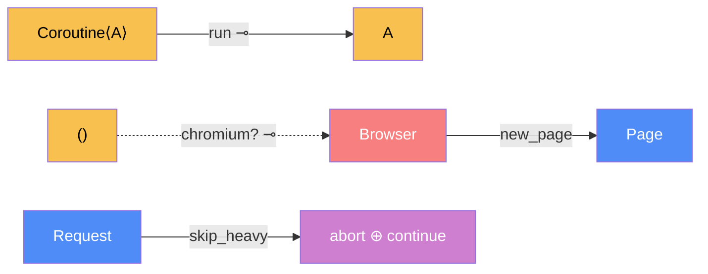

# Browser — categorical model

> Model-first (FRAMEWORK §2/§4). Intended specification for this component. The
> code realises it (see IMPLEMENTATION.md). Source of record: `app/browser.py`.

## 1. Overview
The single seam through which the app starts headless Chromium and opens pages.
Both shop search (`discovery`) and product-page rendering (`extraction`) go
through it.

## 2. Why
This component exists because of **Law 6: `runsAt` is a relation.** Rendering is
placed on four different threads (see §7), and the old sync-API code silently
assumed the calling thread's event loop could start a subprocess. Under
`uvicorn --reload` on Windows it couldn't, and every search died. Modelled
honestly, `run` has to produce the right `Loc` (a loop that can spawn Chromium)
itself, whatever it's called from.

## 3. Core category

## 4. Morphism table
| Morphism | Signature | Partiality | Semantics |
| --- | --- | --- | --- |
| `run` | `Coroutine⟨A⟩ → A` ⊸ | Total | runs on a fresh loop it creates itself (Proactor on Windows), never the process-wide policy |
| `chromium?` | `() → Browser` ⊸ | Partial | raises `BrowserUnavailable` if the driver or Chromium won't start |
| `new_page` | `Browser → Page` | Total | its own context, with the shop user agent, locale and viewport |
| `skip_heavy` | `Request → abort ⊕ continue` | Total | aborts `image`/`font`/`media`, continues everything else |

## 6. Composition rules
1. Chromium is started **only** here (§5 one source of truth). App code never
   imports `playwright.sync_api`.
2. `run` is placement-independent: its result doesn't depend on which thread calls
   it or on the global loop policy.
3. Pages never download images, fonts or media. Scripts, XHR and CSS still load,
   so JS-painted prices still appear.

## 7. Atoms owned (FRAMEWORK §4)
**Trn**
| `Trn` | `t_from → t_to` | Realising code |
| --- | --- | --- |
| `run` | `Coroutine⟨A⟩ → A` | `browser.run` |
| `chromium` | `() → Browser` | `browser.chromium` |
| `new_page` | `Browser → Page` | `browser.new_page` |
| `skip_heavy` | `Request → Decision` | `browser._skip_heavy` |

**Loc**: `Chromium`, a headless child process: one per search, one per product
render. There's also the loop thread `run` executes on.
**Trm**: `t_cdp : ServerProc ⇄ Chromium` (commands, page HTML, extracted rows) and
`t_render : Chromium ⇄ Shop` (the page load, minus heavy resources).
**Placements (§4.2)**: `run` is placed at four sites: the `shop-search` thread
(discovery), the price-lookup pool (discovery stream → extraction), request
workers (`create_product`, `refresh_one`) and the scheduler thread
(`refresh_all`). Four `TrnLoc`s over one `Trn` is exactly Law 6.

## 8. Bridges to other components (ports)
| Boundary morphism | Signature | Stored? | Semantics |
| --- | --- | --- | --- |
| `render_port` | `extraction → browser` | — | product-page render |
| `search_port` | `discovery → browser` | — | one Chromium, a page per shop |
