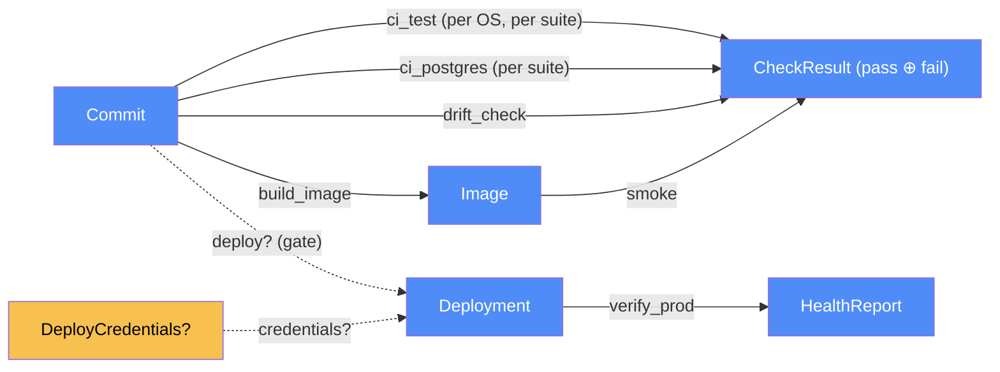

# Delivery — categorical model

> Model-first (FRAMEWORK §2/§4). Intended specification for this component. The
> code realises it (see IMPLEMENTATION.md). Source of record:
> `.github/workflows/ci.yml`, `Dockerfile.vercel`, `vercel.json`.

## 1. Overview
How a commit becomes the running site. GitHub Actions checks every push to `main`
and every pull request: the suites on two operating systems and on Postgres, the
docs drift check, and a smoke test of the container image. Only a fully green
push to `main` is deployed to Vercel production. Vercel runs the same
`Dockerfile.vercel` as a container Function, next to a Neon Postgres database,
and calls `/cron/daily` once a day.

## 2. Why
Delivery is where this system meets locations it doesn't control: a GitHub
runner, a Vercel instance that scales to zero, Vercel's edge, its cron, and
Neon's pooler and database. Modelled as `Loc` and `Trm`, the two properties that
matter become checkable laws rather than good intentions:
- **the gate:** `deploy` is a *partial* morphism, defined only on commits every
  check passed. There's no other path to production (Vercel's Git auto-deploy is
  off);
- **one recipe:** `build_image` is one transformation placed at two locations
  (the CI runner and Vercel's builder), so what's smoke-tested is what's hosted
  (§4.2: `runsAt` is a relation).

## 3. Core category

## 4. Morphism table
| Morphism | Signature | Partiality | Semantics |
| --- | --- | --- | --- |
| `ci_test` | `Commit × OS → CheckResult` ⊸ | Total | byte-compile, then each suite as its own step on SQLite, on Ubuntu and Windows |
| `ci_postgres` | `Commit → CheckResult` ⊸ | Total | the same suites against a `postgres:17` service container (`TEST_DATABASE_URL`) |
| `drift_check` | `Docs × Code → CheckResult` | Total | every `path:symbol` in an IMPLEMENTATION.md resolves (vendored script) |
| `build_image` | `Commit → Image` ⊸ | Total | `Dockerfile.vercel`. Placed twice: the CI runner and Vercel's builder |
| `smoke` | `Image → CheckResult` ⊸ | Total | `/healthz` 200, `/login` 200, and Chromium renders inside the image |
| `deploy?` | `Commit → Deployment` ⊸ | Partial | defined iff push to `main` ∧ `ci_test`, `ci_postgres`, `smoke` all pass ∧ credentials present |
| `credentials?` | `Repo → DeployCredentials` | Partial | `VERCEL_TOKEN`, `VERCEL_ORG_ID`, `VERCEL_PROJECT_ID`. Absent → the deploy is **skipped with a notice**, never a failure or a success |
| `verify_prod` | `Deployment → HealthReport` | Total | curl production `/healthz` until 200 (cold start allowed) |
| `daily_trigger` | `VercelCron → CronCall` | Total | `vercel.json` `crons`: `0 18 * * *` (02:00 SGT), with `Authorization: Bearer $CRON_SECRET` |

## 6. Composition rules
1. **The gate.** `deploy? = defined ⟺ event = push ∧ ref = main ∧ ci_test ∧
   ci_postgres ∧ smoke`. Pull requests never deploy. `vercel.json` sets
   `git.deploymentEnabled: false`, so no push bypasses it.
2. **No credentials, no pretence.** Without `VERCEL_TOKEN` the deploy job exits 0
   with a visible notice. It never reports a deploy that didn't happen.
3. **Tests never touch the hosted database** (invariant 11, extended). The
   Postgres job gets only the service container's URL, and `tests/helpers.py`
   refuses any host but `localhost`/`127.0.0.1` and any URL equal to
   `DATABASE_URL` before it drops anything.
4. **One recipe, two builders.** CI and Vercel both build `Dockerfile.vercel`
   from the same commit. The image runs as a non-root user, carries no `data/`
   contents and no `.env` (`.dockerignore`), and trusts forwarded headers
   (`--proxy-headers`), since Vercel's proxy is the only way in.
5. **Secrets stay names.** `DATABASE_URL` (injected by Neon), `CRON_SECRET` and
   the Vercel token are env only. Nothing echoes them, `/healthz` reveals none of
   them, and driver errors are logged redacted.
6. **A failure names its cause.** Every suite is its own workflow step, so a red
   run says which suite on which OS or engine.
7. **Law 5 is enforced mechanically.** The drift check runs in CI on every push.
   `scripts/drift-check.sh` is the supercharge script, vendored with a header;
   below the header the two are identical.
8. **Scheduled work is daily and bounded.** Vercel Hobby allows one cron run a
   day and 300 s per request. The daily run is budgeted to fit (refresh rule 7).
9. **Close together.** Vercel region `sin1` with Neon in Singapore keeps the
   database round-trips short.
10. **The container needs Vercel's Container Images (Beta) permission.** Without
    it, Vercel builds the repo as a plain Python function: the app runs on Neon,
    but there's no Chromium, so search reports that the browser can't start.
    Seen on `a237b69`, the one push deployed by Vercel's Git auto-deploy while
    the owner tried it (rule 1 was suspended for that push).
11. **The site sits behind Deployment Protection** (Vercel Authentication): only
    team members get past the sign-in redirect. Automation (`verify_prod`)
    passes `x-vercel-protection-bypass` from the `VERCEL_AUTOMATION_BYPASS_SECRET`
    repository secret.

## 7. Atoms owned (FRAMEWORK §4)
**Trn**: `ci_test`, `ci_postgres`, `drift_check`, `build_image`, `smoke`,
`deploy?`, `verify_prod` (workflow jobs); `daily_trigger` (Vercel cron).

**Loc**
| Loc | What it is |
| --- | --- |
| `GitHubRunner` | an Actions VM (ubuntu-latest, windows-latest) |
| `CiPostgres` | the `postgres:17` service container beside the Ubuntu runner |
| `VercelBuild` | Vercel's builder, which builds `Dockerfile.vercel` |
| `VercelInstance` | a container Function running `ServerProc` (2 GB, 1 vCPU, scales to zero after 5 idle minutes, 300 s per request) |
| `VercelEdge` | Vercel's HTTPS proxy in front of every instance |
| `VercelCron` | Vercel's scheduler |
| `NeonPooler` | Neon's PgBouncer, transaction mode (`DATABASE_URL`) |
| `NeonPostgres` | the hosted database (scales to zero when idle) |

**Trm**
| Trm | carries | c_from → c_to |
| --- | --- | --- |
| `t_ci` | the commit's source tree | GitHub → GitHubRunner |
| `t_ci_pg` | rows (test data only) | GitHubRunner ⇄ CiPostgres |
| `t_deploy` | the source tree, via the Vercel CLI | GitHubRunner → VercelBuild |
| `t_edge` | HTTPS requests and pages; `x-forwarded-host`/`-proto` added | UserBrowser ⇄ VercelEdge ⇄ VercelInstance |
| `t_cron` | `CronCall` (GET `/cron/daily`, Bearer secret) | VercelCron → VercelInstance |
| `t_pg` | rows over TLS | VercelInstance ⇄ NeonPooler ⇄ NeonPostgres |

**Placements (§4.2)**
- `build_image`: `GitHubRunner` (the `container` job) and `VercelBuild`. Same
  recipe and commit, two builders. The CI image isn't the deployed artifact byte
  for byte (see suggestions #1).
- `ServerProc` (all of web, refresh, storage's callers): the owner's machine,
  a local Docker container, or a `VercelInstance`.
- storage's `Dat`: `SQLite` locally, `NeonPostgres` when hosted (storage §7).
- `daily_run` (refresh): a request thread on a `VercelInstance`, triggered over
  `t_cron`.

## 8. Bridges to other components (ports)
| Boundary morphism | Signature | Stored? | Semantics |
| --- | --- | --- | --- |
| `t_pg` | `delivery (Neon) ⇄ storage` | Stored | storage's Postgres adapter is the only thing that crosses it |
| `t_cron` | `delivery → web.cron_daily → refresh.daily_run` | — | web checks the secret, refresh does the work |
| `t_edge` | `delivery → web` | — | why web's guard reads the forwarded host and the cookie can be `Secure` |
| `healthz` | `web → delivery` | — | what `smoke` and `verify_prod` read |
| suites | `tests/* → delivery` | — | every component's tests run inside `ci_test` and `ci_postgres` |

## 9. Coherence notes
- **Law 2 (transmission well-typing).** Each new `Trm` has one `carries` type and
  crosses a real boundary. `t_edge` decomposes into two hops, because the
  forwarded-host property lives on the edge hop.
- **Law 4 (dependency mediation).** The runner reaches Vercel only through
  `t_deploy` (the CLI with a token). The instance reaches Neon only through
  `t_pg`, via storage's port.
- **Law 6 (runsAt is a relation).** `build_image` and `ServerProc` are
  explicitly multi-placed, and nothing assumes a single site.
- **Background threads on a `VercelInstance`** may be frozen once a response is
  sent. Best-effort jobs (`run_once`) can therefore stall. The daily run is their
  backstop (refresh rule 8), and it runs *inside* its request, not after it.
