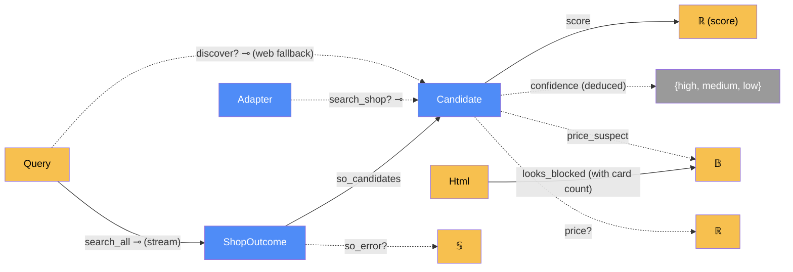

# Discovery — categorical model

> Model-first (FRAMEWORK §2/§4). Intended specification for this component. The
> code realises it (see IMPLEMENTATION.md). Source of record: `app/search/`.

## 1. Overview
Given a product name, it finds candidate listings across the configured shops and
scores each against the query. The primary path renders every shop's own search
page, all at once in one Chromium, and reads the result cards. The fallback, used
when Playwright is missing, is DuckDuckGo's HTML endpoint. Nothing is tracked
here: the user confirms matches in `web`.

## 2. Why
Three things become checkable in this form. A search result is a **sum**
(`Candidate*` ⊕ refused ⊕ failed), so a block can't masquerade as "no results".
The shop searches are **independent parallel arrows** whose outcomes stream in
completion order. And `confidence` is a **deduced** morphism of `score`, so it's
never stored.

## 3. Core category

## 4. Morphism table
| Morphism | Signature | Partiality | Semantics |
| --- | --- | --- | --- |
| `search_all` | `Query × Domain* → ShopOutcome*` ⊸ | Total (a stream) | one outcome per searchable shop, in completion order. Raises `BrowserUnavailable` if Chromium can't start |
| `so_candidates` | `ShopOutcome → Candidate*` | Total | may be empty |
| `so_error?` | `ShopOutcome → 𝕊` | Partial | present when the shop refused, failed or had no results |
| `search_shop` | `Page × Adapter × Domain × Query → Candidate*` ⊸ | Partial | raises `ShopRefused` on a block page |
| `looks_blocked` | `Html × ℕ → 𝔹` | Total | `cards = 0 ∧ (bot wall ∨ len < 20 000)`. A positive signal only |
| `score` | `Candidate → ℝ` | Total | `score_candidate(query, title)` ∈ [0, 1]. Accessories are capped at 0.30 |
| `confidence` | `Candidate → {high, medium, low}` | Deduced | thresholds 0.75 / 0.45 on `score`. Not stored |
| `price?` | `Candidate → ℝ` | Partial | from the result card. Missing ones are fetched later by `web` |
| `price_suspect` | `Candidate → 𝔹` | Total | set by `flag_price_outliers` (far below the median) |
| `discover?` | `Query → Candidate*` ⊸ | Partial | web-search fallback. Raises `SearchUnavailable` when throttled |

## 5. Functors
**Concurrent search.** `_gather_shops` sends the discrete category of searchable
shops to outcomes, one arrow per shop, and runs them with `asyncio.gather`. `_stream`
is the transmission that carries each outcome from the search thread's loop to the
caller's generator (see §7).

## 6. Composition rules
1. **A block is never an empty result** (invariant 3): refused ⇒ `so_error?`
   names the refusal. Throttled web search ⇒ `SearchUnavailable`.
2. **A slow shop is never reported as blocked:** `looks_blocked` fires only on a
   positive signal. A large page with no cards yet gets the full wait.
3. **Independence:** one shop's failure never removes another's outcome. The order
   is completion order.
4. **Matching ranks, the user decides** (invariant 6): accessories are capped at
   0.30. `confidence` is deduced, never stored.
5. **Model tokens are squashed per word**, never across the whole title.
6. **Only searchable shops are searched:** `shops_for` filters on
   `Adapter.supports_site_search`.

## 7. Atoms owned (FRAMEWORK §4)
**Trn**
| `Trn` | `t_from → t_to` | Realising code |
| --- | --- | --- |
| `search_all` | `Query → ShopOutcome*` ⊸ | `site_search.search_all` |
| `gather_shops` | `(Adapter × Domain)* → ShopOutcome*` | `site_search._gather_shops` |
| `search_shop` | `Page × Adapter → Candidate*` ⊸ | `site_search.search_shop` |
| `to_candidates` | `Row* → Candidate*` | `site_search._to_candidates` |
| `looks_blocked` | `Html × ℕ → 𝔹` | `site_search.looks_blocked` |
| `score_candidate` | `Query × Title → ℝ × Flag*` | `matching.score_candidate` |
| `flag_price_outliers` | `Candidate* → Candidate*` (in place) | `matching.flag_price_outliers` |
| `discover` | `Query → Candidate*` ⊸ | `providers.discover` |

**Loc**: the `shop-search` daemon thread, with its own loop; `Chromium`; `Shop`;
`DDG` (fallback).
**Trm**: `t_queue : shop-search thread → request thread`, carrying `ShopOutcome`
(`queue.Queue` inside `_stream`). The `t_render` and `t_cdp` transmissions go
through `browser`. `t_ddg : ServerProc ⇄ DDG` carries the search-result HTML.
**Placements (§4.2)**: `score_candidate` runs both on the search thread (site
search) and on the request thread (web fallback). It's the same `Trn` at two sites.

## 8. Bridges to other components (ports)
| Boundary morphism | Signature | Stored? | Semantics |
| --- | --- | --- | --- |
| `search_port` | `discovery → browser` | — | `browser.chromium` + `new_page` + `run` |
| `adapter_read` | `extraction.Adapter → discovery` | — | search selectors, price parsing, bot-wall check |
| `outcome_stream` | `discovery → web` | — | `search_all` is iterated by `web.discover_stream` |
| `confirm` | `Candidate → storage.Source` | Stored (after a user tick) | only `url` crosses. See the suggestions |

## 9. Coherence notes
- **Law 4 (mediation):** the search thread never touches the request thread's
  state. Outcomes cross only through the `t_queue` transmission.
- **Law 1:** `EXTRACT_JS` runs inside `Chromium`, where the page is materialised.
  Only plain rows cross back over `t_cdp`.
