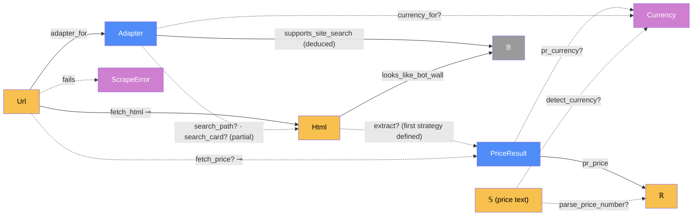

# Extraction — categorical model

> Model-first (FRAMEWORK §2/§4). Intended specification for this component. The
> code realises it (see IMPLEMENTATION.md). Source of record: `app/scraper.py`,
> `app/adapters.py`.

## 1. Overview
Turns a product-page URL into one price: `(amount, shop's currency, strategy)`, or
a readable failure. It holds all per-shop knowledge (`Adapter`): which domain is
which shop, its currency, where its price hides, and how to search it.

## 2. Why
Extraction is an ordered chain of **partial** morphisms, where the first one
defined wins. Written as a category, "first number wins" becomes a composition
rule you can check. It also makes the two lies this component must never tell
explicit. A crossed-out list price must not be read as the price, and a bot wall
must not be read as "no price found" (invariants 2 and 3). `Adapter` is also the
repo's clearest case of §3 consolidation: search knowledge is a set of *partial*
morphisms on the one shop object, not a parallel `SearchAdapter`.

## 3. Core category

## 4. Morphism table
| Morphism | Signature | Partiality | Semantics |
| --- | --- | --- | --- |
| `adapter_for` | `Url → Adapter` | Total | the shop by hostname. `GENERIC` for unknown shops |
| `fetch_html` | `Url → Html` ⊸ | Partial | plain HTTP GET with browser headers |
| `extract?` | `Html → PriceResult` | Partial | the first strategy that yields a number |
| `fetch_price?` | `Url → PriceResult` ⊸ | Partial | `extract? ∘ fetch_html`, then a browser render as a last resort. Otherwise it raises `ScrapeError` |
| `fails` | `Url → ScrapeError` | Partial | the complement of `fetch_price?`: a readable reason (blocked, needs JS, no price) |
| `pr_price` | `PriceResult → ℝ` | Total | the selling price |
| `pr_currency?` | `PriceResult → Currency` | Partial | from the symbol or code, else the domain's currency |
| `currency_for?` | `Adapter → Currency` | Partial | the shop's currency for a host suffix (amazon.sg → SGD) |
| `search_path?`, `search_card?`, … | `Adapter → 𝕊` | Partial | only shops with site search define them |
| `supports_site_search` | `Adapter → 𝔹` | Deduced | `search_path? ≠ ∅ ∧ search_card? ≠ ∅`, the discriminator |
| `parse_price_number` | `𝕊 → ℝ` | Partial | locale-aware: `Rp1.234.567` = 1234567 |
| `detect_currency` | `𝕊 × Url → Currency` | Partial | symbol, then ISO code, then the domain's currency |
| `looks_like_bot_wall` | `Html → 𝔹` | Total | a challenge page, whatever its HTTP status |

## 5. Functors
**Strategy chain.** `extract? = shopee_api ⊕? user_selector ⊕? adapter_selectors
⊕? json_ld ⊕? meta ⊕? embedded_json ⊕? render`, where `f ⊕? g` means "`f` if
defined, else `g`". It's an ordered sum of partial morphisms into
`PriceResult`, so order matters and is part of the spec.

## 6. Composition rules
1. **First number wins**, in the order in §5. Strategies never average or vote.
2. **Never a list price** (invariant 2). Lazada's `pdt_price` is excluded from
   `EMBEDDED_PRICE_PATTERNS`. Lazada is `needs_js` and priced from the rendered
   sale-price node.
3. **A block is not an empty result** (invariant 3). `looks_like_bot_wall ⇒` the
   `ScrapeError` says "blocked", never "no price found".
4. **Money parsing:** 1–2 trailing digits after the last separator is a decimal
   point; otherwise it's grouping. Never `float()` on shop text.
5. **Consolidation (§3):** one `Adapter` per shop. Search knowledge is partial
   morphisms on it, discriminated by `supports_site_search`.

## 7. Atoms owned (FRAMEWORK §4)
**Trn**
| `Trn` | `t_from → t_to` | Realising code |
| --- | --- | --- |
| `fetch_price` | `Url × Selector? → PriceResult` ⊸ | `scraper.fetch_price` |
| `extract` | `Html → PriceResult?` | `scraper._extract` + `_from_*` |
| `shopee_api` | `Url → PriceResult` ⊸ | `scraper._shopee_api` |
| `render` | `Url → Html` ⊸ (via browser) | `scraper._render_with_playwright` |
| `parse_price_number`, `detect_currency`, `looks_like_bot_wall` | pure | `scraper.*` |
| `extract_from_html` | `Html × Url → PriceResult?` (never renders) | `scraper.extract_from_html`, used by `history` for archived pages |
| `adapter_for`, `retailer_label`, `shopee_ids` | pure | `adapters.*` |

**Loc**: the caller's thread in `ServerProc`, `Shop` (external), and `Chromium`
(through `browser`).
**Trm**: `t_shop_http : ServerProc → Shop → ServerProc`, carrying `Html` (requests).
The render path's transmissions belong to `browser`.
**Placements (§4.2)**: `fetch_price` has **four** `TrnLoc`s: the request worker
(`create_product`, `refresh_one`), the price-lookup pool (discovery stream), the
scheduler thread (`refresh_all`), and the test process. See `browser` for why that
matters.

## 8. Bridges to other components (ports)
| Boundary morphism | Signature | Stored? | Semantics |
| --- | --- | --- | --- |
| `render_port` | `extraction → browser` | — | `browser.run(_render(...))`, the only way extraction reaches Chromium |
| `adapter_read` | `Adapter → discovery` | — | discovery reads search selectors, `parse_price_number`, `detect_currency` and `looks_like_bot_wall` |
| `price_out` | `PriceResult → refresh / web` | Stored by refresh | becomes a `PriceSnapshot` (success branch) |

## 9. Coherence notes
- **One `Dat`, two `DataLoc`s.** `PriceResult`/`ScrapeError` are the in-RAM forms
  of storage's `PriceSnapshot`, success and failure respectively. They aren't a
  parallel object. `refresh_source` is the transmission to the durable `DataLoc`.
- **Law 6.** Four placements of `fetch_price` is why rendering must not depend on
  the calling thread's event-loop setup.
