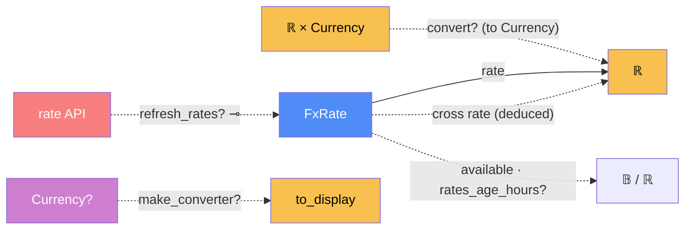

# FX — categorical model

> Model-first (FRAMEWORK §2/§4). Intended specification for this component. The
> code realises it (see IMPLEMENTATION.md). Source of record: `app/fx.py`.

## 1. Overview
Currency conversion at compare and display time only. It fetches USD-based rates
from a free API, caches them in SQLite for up to 12 h, and converts between any
two cached currencies.

## 2. Why
Every cross rate is **deduced** through one base (`A→B = rate(B) / rate(A)`), so
only one row per currency is stored. And conversion is a morphism that is
**never applied on write** (invariant 1). Modelled as a category, "convert only at
read time" becomes a statement about which components may call `convert`, and
none of them write snapshots.

## 3. Core category

## 4. Morphism table
| Morphism | Signature | Partiality | Semantics |
| --- | --- | --- | --- |
| `convert?` | `ℝ? × Currency? × Currency? → ℝ` | Partial | identity for the same currency (no rates needed). None when unknown or no rate |
| `cross rate` | `Currency × Currency → ℝ` | Deduced | `rate(to) / rate(from)` via USD. Not stored per pair |
| `refresh_rates?` | `() → 𝔹` ⊸ | Partial | fetch if stale (>12 h). On failure it keeps the old rates |
| `rate` | `FxRate → ℝ` | Total | units per USD (stored by `storage`) |
| `make_converter?` | `Currency? → ToDisplay` | Partial | None when conversion is off |
| `available` | `() → 𝔹` | Total | any rates cached |
| `rates_age_hours?` | `() → ℝ` | Partial | age of the cache, shown in the UI |

## 6. Composition rules
1. **Never on write:** no caller converts a price before storing it (invariant 1).
2. `convert(a, X, X) = round(a, 2)` without touching the rates, so the as-quoted
   path works offline.
3. Sources are tried in order (`open.er-api`, then `frankfurter`), and the first
   non-empty answer wins.
4. **Figures are mid-market.** They exclude card FX fees, shipping and duty
   (documented).

## 7. Atoms owned (FRAMEWORK §4)
**Trn**: `convert`, `make_converter`, `refresh_rates`, `_fetch_rates`,
`rates_age_hours`, `available`.
**Loc**: `ServerProc`, `FxApi` (external) and `SQLite` (the cache).
**Trm**: `t_fx : FxApi → ServerProc`, carrying a `{currency: rate}` JSON; `t_sql`
for the cache.
**Placements (§4.2)**: `refresh_rates` runs at startup (`lifespan`) and in the
request that changes the display currency.

## 8. Bridges to other components (ports)
| Boundary morphism | Signature | Stored? | Semantics |
| --- | --- | --- | --- |
| realises `to_display` | `fx → analysis` | — | adapter for analysis's port |
| realises `convert` | `fx → analysis / web` | — | used by `target_in`, `_chart_points` and the discovery summary |
| `rate_cache` | `fx ⇄ storage.FxRate` | Stored | |
