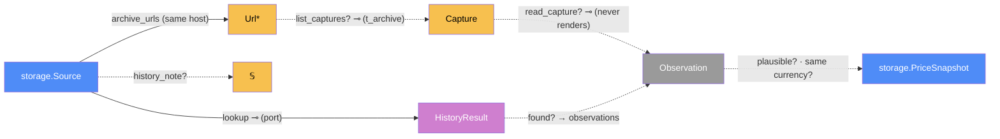

# History — categorical model

> Model-first (FRAMEWORK §2/§4). Intended specification for this component. The
> code realises it (see IMPLEMENTATION.md). Source of record: `app/history.py`.

## 1. Overview
Gives a tracked listing its past prices on day one. It finds archived copies of
the listing's **own** page in a public archive (the Internet Archive's Wayback
Machine), reads each copy's price with the normal extractor, and stores the
results as that listing's past `PriceSnapshot`s, marked `origin = wayback` and
dated at capture time. The lookup runs in the background, once per product, and
is polite to the archive.

## 2. Why
The §3 reduction decides the design. An "archived price" has exactly
`PriceSnapshot`'s morphisms (source, price, currency, observed-at), and every
square commutes. The only unpaired morphism is provenance. So it's a
`PriceSnapshot` with a partial `origin?`, **not** a parallel history table. Every
consumer of history (series, chart, verdict) picks it up with no new path. The
model also makes three honesty rules explicit:
- `HistoryResult` is a **sum**, so "archive down" can't read as "no history";
- the current price is a morphism defined only on live rows;
- a JS-priced shop's archived copy has no sale-price morphism at all.

## 3. Core category

## 4. Morphism table
| Morphism | Signature | Partiality | Semantics |
| --- | --- | --- | --- |
| `archive_urls` | `Url × Adapter → Url*` | Total | the listing URL without its query, plus the adapter's canonical form (Amazon `/dp/<ASIN>`), same host only |
| `list_captures?` | `Url* → Capture*` ⊸ | Partial | CDX index, one per month (the latest), newest 24. Fails as `unavailable` |
| `read_capture?` | `Capture → Observation` ⊸ | Partial | raw `id_` bytes → `extract_from_html`. Undefined when there's no readable price |
| `lookup` (port) | `Source × Adapter → HistoryResult` ⊸ | Total | `found(Observation*) ⊕ none ⊕ unavailable ⊕ unsupported` |
| `found? → observations` | `HistoryResult → Observation*` | Partial | only on `found` |
| `plausible? · same currency?` | `Observation → PriceSnapshot` | Partial | kept iff the currency equals the listing's and it's within `[median/3, median×3]` (with ≥ 3 values) |
| `history_note?` | `Source → 𝕊` | Partial | the outcome shown per listing (a storage column) |

## 5. Functors
**Outcome → note.** The `HistoryResult` sum maps to user text: `found` → "N
archived prices, first to last (k new). Excluded: …"; the other three → their
reason. This is the only path from the archive to the UI.

## 6. Composition rules
1. **Exact matching:** observations come only from `archive_urls(source)`. Never
   another listing, shop or country domain.
2. **Never render; never a list price.** `needs_js` adapters are `unsupported`
   before any request (invariant 2).
3. **Never convert** (invariants 1 and 4). A different-currency observation is
   dropped, not stored.
4. **Current price is live-only:** `web._latest_per_source` ignores rows with
   `origin?`. History and the verdict use them.
5. **Idempotent:** dedup on `origin_ref`, so re-running adds only new captures.
6. **Polite:**
   - ≤ 15 requests/min (`REQUEST_GAP_S = 4`);
   - stop at the first 429 or refused connection;
   - a process-wide pause of 15 min after a 429, 60 min after a refusal;
   - one job per product.
7. **An admin's pause is obeyed at once:** nothing new is scheduled, a queued or
   running product job stops at its next listing, and a running lookup stops
   before its next capture. An admin often pauses *because* the archive is
   rate-limiting us, so finishing 24 more requests would defeat the point.
8. **A deadline stop records nothing.** The daily cron run passes `stop` (its
   deadline, or the archive's cooldown). A lookup it cuts short returns
   `CUT_SHORT_REASON` and `backfill_source` writes **no** note, so
   `history_checked_at` stays NULL and the next run looks the listing up again.
   (A pause, by contrast, is recorded, as rule 7 says.)

## 7. Atoms owned (FRAMEWORK §4)
**Trn**
| `Trn` | `t_from → t_to` | Realising code |
| --- | --- | --- |
| `archive_urls` | `Url × Adapter → Url*` | `history.archive_urls` |
| `wayback_lookup` | `Source × Adapter → HistoryResult` ⊸ | `history.wayback_lookup` |
| `filter_observations` | `Observation* × Currency × ℝ* → kept, other, implausible` | `history.filter_observations` |
| `backfill_source` | `Source → ()` ⊸ | `history.backfill_source` |
| `backfill_product` | `Product → ()` ⊸ | `history.backfill_product` |
| `schedule_backfill` | `Product → ()` ⊸ | `history.schedule_backfill` |

**Loc**: the scheduler's worker thread (a one-off job per product) and `Archive`
(web.archive.org, external).
**Trm**: `t_archive : Archive → ServerProc`, carrying `Capture*` (the CDX JSON)
or `Html` (a raw capture). Stored results go over `t_sql` via storage.
**Placements (§4.2)**: `extract_from_html` now has two placements: live
extraction (any thread) and archived reading (the scheduler thread). Neither
renders.

## 8. Bridges to other components (ports)
| Boundary morphism | Signature | Stored? | Semantics |
| --- | --- | --- | --- |
| `lookup` port | `Source × Adapter → HistoryResult` | — | `HISTORY_SOURCES`. Wayback is realised; BuyWhere is planned |
| `read` | `history → extraction.extract_from_html` | — | the same extractor as live, minus rendering |
| `record` | `history → storage` | Stored | `add_snapshot(origin='wayback')`, `set_history_note` |
| `trigger` | `web → history.schedule_backfill` | — | after add product / track / add source; the button |
| `run_once` | `history → refresh.scheduler` | — | a one-off job on the existing scheduler |

## 9. Coherence notes
- **Law 4:** the web request never waits on the archive. It schedules and
  returns; the job writes rows the page reads later.
- **Law 2:** `t_archive` is typed (CDX rows or HTML) and crosses a real boundary.
- **Storage rule 1 (success ⊕ failure)** still holds, because history writes
  success rows only. It is, however, a **second writer** of `PriceSnapshot`. See
  storage suggestions #1.
