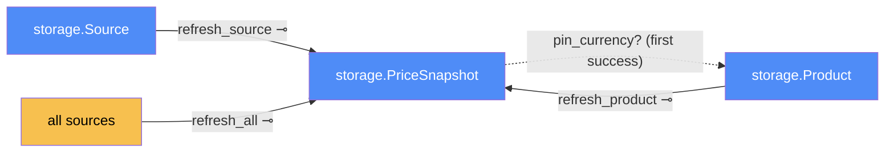

# Refresh — categorical model

> Model-first (FRAMEWORK §2/§4). Intended specification for this component. The
> code realises it (see IMPLEMENTATION.md). Source of record: `app/refresh.py`,
> `app/scheduler.py`.

## 1. Overview
It re-checks tracked listings and records every attempt, success or failure, as a
snapshot. It runs on demand (routes) and every `REFRESH_INTERVAL_HOURS` (default
6) from a background scheduler.

## 2. Why
Refresh is the **only transmission into the durable price history**: extraction's
in-RAM `PriceResult ⊕ ScrapeError` becomes a stored `PriceSnapshot`. Modelling it
that way pins down that exactly one component writes snapshots, which is what
makes storage's success ⊕ failure rule hold.

## 3. Core category

## 4. Morphism table
| Morphism | Signature | Partiality | Semantics |
| --- | --- | --- | --- |
| `refresh_source` | `Source → PriceSnapshot` ⊸ | Total | always writes one snapshot: a price, or the error text |
| `refresh_product` | `Product → PriceSnapshot*` ⊸ | Total | its sources in order, 1.5 s apart |
| `refresh_all` | `() → PriceSnapshot*` ⊸ | Total | every source, 1.5 s apart (the scheduled job) |
| `pin_currency?` | `PriceSnapshot → Product` | Partial | sets `Product.currency` if it's still NULL |

## 6. Composition rules
1. **Every attempt is recorded.** A failure is a snapshot with `error`, so the UI
   can say *why* a shop shows no price.
2. **Polite and sequential:** `DELAY_BETWEEN_REQUESTS = 1.5 s`, never concurrent
   (a deliberate choice, 2026-09-24). Batches (the schedule, an admin's "refresh
   everything", a user's "refresh my prices") **take turns** on `_batch_lock`.
   Two at once would hit the same shops twice as fast. The admin button runs the
   scheduled job early rather than adding a parallel copy of it.
3. **The quoted currency is stored.** No conversion happens here (invariant 1).
4. One bad source never aborts a batch: unexpected errors become error snapshots.
   A listing deleted while its price was being fetched is skipped, not an error.
5. **Web requests never wait on a batch.** "Refresh my prices" queues a background
   job (one per user) and returns at once. Holding the request open for
   sources × 1.5 s would tie up a worker and time out the browser.

## 7. Atoms owned (FRAMEWORK §4)
**Trn**: `refresh_source`, `refresh_product`, `refresh_all`, `start_scheduler`,
`stop_scheduler`.
**Loc**: the scheduler thread (APScheduler `BackgroundScheduler`) and request
workers (the routes). It reaches `Shop` and `Chromium` through extraction.
**Trm**: `t_sql` (writes snapshots); shop access goes through extraction.
**Placements (§4.2)**: `refresh_product` runs on request workers
(`create_product`, `track_from_discovery`, `refresh_one`), and `refresh_all` runs
on the scheduler thread and on a request worker (`refresh_everything`).

## 8. Bridges to other components (ports)
| Boundary morphism | Signature | Stored? | Semantics |
| --- | --- | --- | --- |
| `fetch` | `refresh → extraction.fetch_price` | — | one price per source |
| `record` | `refresh → storage` | Stored | `add_snapshot`, `set_product_currency` |
| `refresh_now` | `web → refresh` | — | routes trigger it directly |
