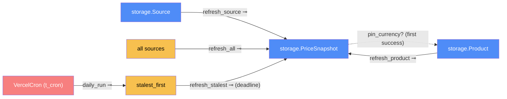

# Refresh — categorical model

> Model-first (FRAMEWORK §2/§4). Intended specification for this component. The
> code realises it (see IMPLEMENTATION.md). Source of record: `app/refresh.py`,
> `app/scheduler.py`.

## 1. Overview
It re-checks tracked listings and records every attempt, success or failure, as a
snapshot. It runs on demand (routes) and on a schedule, in one of two modes
(`SchedulerMode`): every `REFRESH_INTERVAL_HOURS` (default 6) from a background
scheduler (`in-process`, local and Docker), or once a day when the host calls
`GET /cron/daily` (`cron`, the hosted site, whose instances scale to zero).

## 2. Why
Refresh is the **only transmission into the durable price history**: extraction's
in-RAM `PriceResult ⊕ ScrapeError` becomes a stored `PriceSnapshot`. Modelling it
that way pins down that exactly one component writes snapshots, which is what
makes storage's success ⊕ failure rule hold.

## 3. Core category

## 4. Morphism table
| Morphism | Signature | Partiality | Semantics |
| --- | --- | --- | --- |
| `refresh_source` | `Source → PriceSnapshot` ⊸ | Total | always writes one snapshot: a price, or the error text |
| `refresh_product` | `Product → PriceSnapshot*` ⊸ | Total | its sources in order, 1.5 s apart |
| `refresh_all` | `() → PriceSnapshot*` ⊸ | Total | every source, 1.5 s apart (the scheduled job) |
| `pin_currency?` | `PriceSnapshot → Product` | Partial | sets `Product.currency` if it's still NULL |
| `SchedulerMode` | env `SCHEDULER_MODE` → `in-process ⊕ cron` | Total | default `in-process`; only `cron` (any case) selects cron |
| `stalest_first` | `() → Source*` | Total | every listing: never-checked first, then by latest **live** check (a failed check counts, an archived row doesn't), ties by id. Deduced from snapshots, not stored |
| `refresh_stalest` | `Source* × Deadline → PriceSnapshot*` ⊸ | Total | `within_budget`: checks in `stalest_first` order and **stops starting** new checks once the deadline passes |
| `daily_run` | `Clock → Report` ⊸ | Partial (auth, at the route) | the cron call: `refresh_stalest` until `DAILY_REFRESH_S`, then, unless paused, the history sweep of unchecked listings until `DAILY_HISTORY_S` |

## 6. Composition rules
1. **Every attempt is recorded.** A failure is a snapshot with `error`, so the UI
   can say *why* a shop shows no price.
2. **Polite and sequential:** `DELAY_BETWEEN_REQUESTS = 1.5 s`, never concurrent
   (a deliberate choice, 2026-09-24). Batches (the schedule, an admin's "refresh
   everything", a user's "refresh my prices") **take turns** on `_batch_lock`.
   Two at once would hit the same shops twice as fast. The admin button runs the
   scheduled job early rather than adding a parallel copy of it.
3. **The quoted currency is stored.** No conversion happens here (invariant 1).
4. One bad source never aborts a batch: unexpected errors become error snapshots.
   A listing deleted while its price was being fetched is skipped, not an error.
5. **Web requests never wait on a batch.** "Refresh my prices" queues a background
   job (one per user) and returns at once. Holding the request open for
   sources × 1.5 s would tie up a worker and time out the browser.
   Note: the one exception is `GET /cron/daily`, which the **host** calls. It
   holds its request open on purpose, because a Vercel instance may freeze
   background threads once a response is sent. It's bounded by rule 7.
6. **`in-process ⊕ cron`.** In `cron` mode `start_scheduler` adds **no** interval
   job (the scheduler still runs, for `run_once` jobs). The admin page then shows
   the host's daily schedule instead of an interval (settings rule 5).
7. **The daily run fits in one request.** Vercel Hobby cuts a request at 300 s.
   No new price check starts after `DAILY_REFRESH_S` (150 s), and no new archive
   request after `DAILY_HISTORY_S` (230 s). The slowest single step after a
   deadline (a check ≈ 75 s, an archive index request ≤ 60 s) still ends in time.
8. **Resumable from stored state, not a queue.** A listing the run didn't reach
   is simply still the stalest, and a listing whose archive lookup was cut short
   keeps `history_checked_at = NULL`. The next run starts with both. Nothing is
   stored twice (§6.3).
9. The daily run shares `_batch_lock` with every other batch (rule 2).

## 7. Atoms owned (FRAMEWORK §4)
**Trn**: `refresh_source`, `refresh_product`, `refresh_all`, `stalest_first`,
`refresh_stalest`, `daily_run`, `start_scheduler`, `stop_scheduler`.
**Loc**: the scheduler thread (APScheduler `BackgroundScheduler`) and request
workers (the routes), inside `ServerProc`, which runs on the owner's machine or
on a `VercelInstance`. It reaches `Shop` and `Chromium` through extraction.
**Trm**: `t_sql` (writes snapshots); `t_cron` (the host's authenticated daily
trigger, `VercelCron → VercelInstance`, owned by delivery); shop access goes
through extraction.
**Placements (§4.2)**: `refresh_product` runs on request workers
(`create_product`, `track_from_discovery`, `refresh_one`), and `refresh_all` runs
on the scheduler thread and on a request worker (`refresh_everything`).
`daily_run` runs only on a request worker (the `/cron/daily` call), never on the
scheduler thread.

## 8. Bridges to other components (ports)
| Boundary morphism | Signature | Stored? | Semantics |
| --- | --- | --- | --- |
| `fetch` | `refresh → extraction.fetch_price` | — | one price per source |
| `record` | `refresh → storage` | Stored | `add_snapshot`, `set_product_currency` |
| `refresh_now` | `web → refresh` | — | routes trigger it directly |
| `daily_trigger` | `delivery (t_cron) → web → refresh.daily_run` | — | the host's daily call, secret-checked in web |
| `history_sweep` | `refresh.daily_run → history.backfill_product(only_unchecked, stop)` | Stored (`history_checked_at`) | resumes lookups that never finished |
