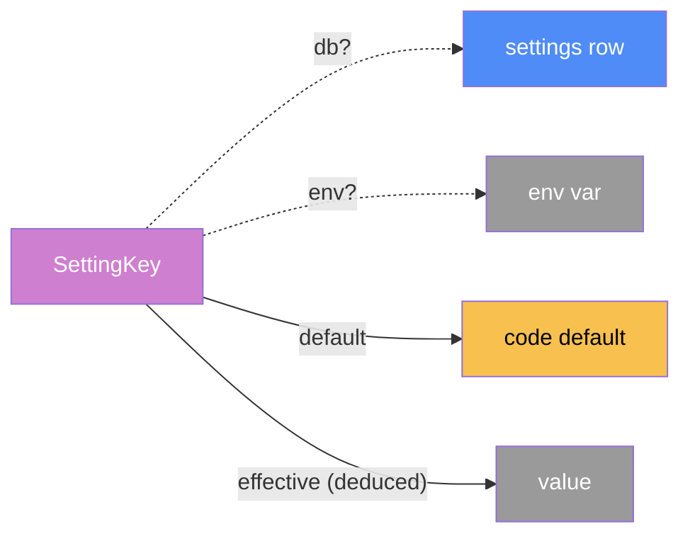

# Settings — categorical model

> Model-first (FRAMEWORK §2/§4). Intended specification for this component. The
> code realises it (see IMPLEMENTATION.md). Source of record: `app/site_settings.py`,
> `app/admin.py` (the settings and maintenance routes).

## 1. Overview
The site-wide values an admin can change without a restart:
- the default display currency;
- the shops searched;
- the refresh interval;
- the discovery limits;
- whether archive lookups are paused.

It also covers the admin's maintenance actions: refresh everything, refresh FX,
and pause or resume lookups.

## 2. Why
Each value is a **deduced** morphism: `effective(key) = db(key) ∨ env(key) ∨
default(key)`, with validation at each step. Reading it at use time, rather than
at import, is what makes "no restart" true. Before this change, the values were
module constants frozen at import. Validation happens in `clean_*`, before any
write, so an invalid value never becomes the stored one.

`db?` is kept **partial on purpose**: the admin form stores a value only when it
differs from the effective one. Storing every field on every save would freeze
the env var and code default of every untouched field into the DB, silently
turning off later env changes (found by the 2026-09-24 code review).

## 3. Core category

## 4. Morphism table
| Morphism | Signature | Partiality | Semantics |
| --- | --- | --- | --- |
| `db?` | `SettingKey → value` | Partial | the admin's saved value |
| `env?` | `SettingKey → value` | Partial | the old environment variable (`REFRESH_INTERVAL_HOURS`, `DISCOVER_*`, `SEARCH_DOMAINS`) |
| `default` | `SettingKey → value` | Total | built in |
| `effective` | `SettingKey → value` | Deduced | the first *valid* of db, env, default. Read at use time |
| `ignored_env` | `() → 𝕊*` | Total | env values that are set but invalid: logged once and listed on the admin page, never dropped silently |
| shops searched | `() → Domain*` | Deduced | `available_shops − search_domains_off`. The **off**-list is stored, so a shop added to `ADAPTERS` later is searched without an admin |

## 6. Composition rules
1. **Range-checked:** refresh 1–168 h; per-shop 1–20; price lookups 0–20. The
   currency must be one of `DISPLAY_CURRENCIES`. Shops are matched *exactly*
   against the known list (never a substring), so an admin can switch shops off
   but never add an arbitrary site.
2. **Clean first, write after:** the admin form cleans every field before writing
   any, so an invalid field changes nothing at all. Only changed values are
   stored (see §2).
3. **Applied live:** search reads `search_domains()` per search; the stream reads
   the limits per request; the refresh interval reschedules the running job, and
   only when it changed (a reschedule restarts the countdown).
4. **Pause is honoured at the source and mid-run:** `history.schedule_backfill`
   schedules nothing while paused; a queued or running `backfill_product` stops at
   the next listing; `wayback_lookup` stops before its next capture.

## 7. Atoms owned (FRAMEWORK §4)
**Trn**: the typed getters and validated setters in `site_settings`, and
`scheduler.set_refresh_interval`.
**Loc**: `ServerProc`, `SQLite` (`settings` table).
**Trm**: `t_sql` only.

## 8. Bridges to other components (ports)
| Boundary morphism | Signature | Stored? | Semantics |
| --- | --- | --- | --- |
| `search_domains` | `settings → discovery` | Stored | `providers.search_domains` delegates here |
| limits | `settings → web` | Stored | `discover_stream`, `discover_page` |
| refresh interval | `settings → refresh` | Stored | `start_scheduler`, `set_refresh_interval` |
| history pause | `settings → history` | Stored | `schedule_backfill` |
| default currency | `settings → web / templating` | Stored | anonymous visitors, and users without a preference |
