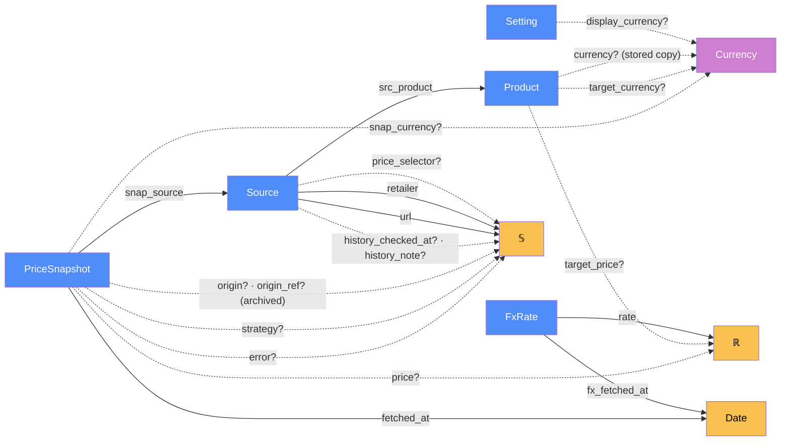

# Storage — categorical model

> Model-first (FRAMEWORK §2/§4). Intended specification for this component. The
> code realises it (see IMPLEMENTATION.md). Source of record: `app/database.py`.

## 1. Overview
The durable store: products, the shop listings (sources) tracking each one, the
price history of every fetch attempt, user settings, and the FX rate cache. Plain
SQL with no ORM, behind **one port with two adapters** (FRAMEWORK §7.4):
`get_connection()` returns a SQLite connection to `data/app.db` (the default,
opened per call) or, when `DATABASE_URL` is set, a pooled Postgres connection
(the hosted site, on Neon). Every other module calls `db.*` and never names a
driver.

## 2. Why
Modelling it as a category makes two things explicit that a schema can't. A
`PriceSnapshot` is a **sum**, success ⊕ failure, so a failed fetch is data rather
than a missing row. And `Product.currency` is a **stored copy of a deduced
morphism**, which needs a stated consistency mechanism (§5 "deduce, don't
store").

The hosted engine adds one more reason. Moving to Postgres adds **no new data
object**: the rows, tables and schema are the same `Dat` materialised at a
second `Loc` (`SQLite ⊕ NeonPostgres`, §3). What's new is one config object
(`Backend`) and a few morphisms (`connect`, `write_transaction`, `translate`)
that realise the same contract on both engines.

## 3. Core category

## 4. Morphism table
| Morphism | Signature | Partiality | Semantics |
| --- | --- | --- | --- |
| `src_product` | `Source → Product` | Total | the product this listing is one shop's offer of (ON DELETE CASCADE) |
| `snap_source` | `PriceSnapshot → Source` | Total | which listing was fetched (ON DELETE CASCADE) |
| `fetched_at` | `PriceSnapshot → Date` | Total | when the attempt was made (UTC ISO) |
| `price?` | `PriceSnapshot → ℝ` | Partial | present iff the fetch succeeded |
| `snap_currency?` | `PriceSnapshot → Currency` | Partial | the **shop's own** currency, never a converted one |
| `error?` | `PriceSnapshot → 𝕊` | Partial | present iff the fetch failed. Why the UI shows no price |
| `strategy?` | `PriceSnapshot → 𝕊` | Partial | which extraction strategy won |
| `origin?` | `PriceSnapshot → {wayback}` | Partial | NULL = a live check. Set = read from an archived copy of the same listing (the §3 discriminator; see `history`) |
| `origin_ref?` | `PriceSnapshot → Url` | Partial | the archived copy it came from. Provenance and dedup key |
| `history_checked_at?`, `history_note?` | `Source → Date`, `Source → 𝕊` | Partial | when the archive was last asked, and what it said |
| `target_price?` | `Product → ℝ` | Partial | the user's buy-at-or-below amount, as typed |
| `target_currency?` | `Product → Currency` | Partial | currency the target was typed in. NULL = "Shop's currency" = `currency?` |
| `currency?` | `Product → Currency` | Partial (stored copy) | the product's **primary currency**. Deduced as `snap_currency ∘ first successful snapshot`, stored write-once |
| `url`, `retailer` | `Source → 𝕊` | Total | the listing and its shop label |
| `price_selector?` | `Source → 𝕊` | Partial | user-supplied CSS selector for unknown shops |
| `display_currency?` | `Setting → Currency` | Partial | the "Show prices in" choice. Absent = as quoted |
| `rate` | `FxRate → ℝ` | Total | units of `quote` per 1 `base` (base is always USD) |
| `fx_fetched_at` | `FxRate → Date` | Total | age of the cached rate |
| `Backend` | `sqlite(DB_PATH) ⊕ postgres(DATABASE_URL)` | Total | chosen by configuration: `DATABASE_URL` set → Postgres |
| `connect` | `Backend → Conn` | Partial (network) | the port. Failure raises `DatabaseUnavailable` |
| `Row` | `name ⊕ index → value`, `keys`, `dict` | Total | a row reads the same on both engines (`sqlite3.Row`, or `database.Row` on Postgres) |
| `schema` | `Dialect → SQL` | Total | one schema text with two tokens, `{pk}` and `{username}` |
| `write_transaction` | `Conn → ctx` ⊸ | Partial (blocks) | the one exclusive-write primitive for check-then-write rules |
| `translate` | `DriverError → IntegrityError ⊕ DatabaseUnavailable` | Total | the app's own error types. Unknown errors pass through unchanged |
| `ping` | `() → ()` | Partial | `SELECT 1` through the port, for `/healthz` |

## 5. Functors
**Schema migration** is a functor from the v1 category (url and selector stored on
`Product`, snapshots keyed by product) to v2. It sends each v1 `Product` to a
`Product` plus one `Source`, and each v1 snapshot to a `PriceSnapshot` of that
source. It's identity on history, so no price is lost. Additive columns
(`target_currency`) extend the category and don't need a functor.

## 6. Composition rules
1. `price?(n) ≠ ∅ ⊕ error?(n) ≠ ∅`: every snapshot is exactly one of success or
   failure.
2. `snap_currency?` is whatever the shop quoted. Nothing ever writes a converted
   price (CLAUDE.md invariant 1).
3. `currency?(p)` is written once: set only while NULL, from the first successful
   fetch that reports a currency. It's a justified stored copy because it pins
   ranking even if that first shop later fails. The consistency mechanism is
   write-once.
4. A table rebuild runs with `foreign_keys = OFF` **and** `legacy_alter_table = ON`
   (invariant 8). Otherwise `DROP` of the renamed table cascades into migrated
   rows.
5. Order at startup: migrate v1 → apply `SCHEMA` → add missing columns. Indexes in
   `SCHEMA` reference v2 columns, and `ADD COLUMN` needs the table to exist.
6. **Archived rows are history, never the current price.** `origin? ≠ ∅` rows
   count in the series and the verdict, but the "latest per source" view ignores
   them. `fetched_at` means *observed at*: the capture time for archived rows.
   Note: `PriceSnapshot` now has **two writers**, `refresh` (live, success ⊕
   failure) and `history` (archived, success only). Rule 1 holds for both.
7. **One port.** Nothing reaches a database except through `get_connection`, and
   no module but `database` imports a driver. Callers see `Row`, `IntegrityError`
   and `DatabaseUnavailable`, never `sqlite3.*` or `psycopg.*`.
8. **One dialect for queries.** SQL is written once with `?` placeholders (the
   Postgres adapter rewrites them to `%s`). Money is `DOUBLE PRECISION`, never
   `REAL`: Postgres `REAL` keeps about 7 digits and would round IDR 1,234,567.89.
   New ids come from `INSERT … RETURNING id` on both engines. Every list query
   ends its `ORDER BY` with `id`, because Postgres doesn't break ties by insertion
   order. `NULLS FIRST` is written out because the engines disagree on the
   default.
9. **`write_transaction` is lock-first.** SQLite: `BEGIN IMMEDIATE`. Postgres:
   `pg_advisory_xact_lock(USER_GUARD_LOCK)` as the transaction's **first**
   statement, under READ COMMITTED (pinned per connection). Then the count after
   the wait sees the other caller's commit. Under REPEATABLE READ the snapshot
   would predate the wait and the race would reopen. Transaction-scoped locks
   work through Neon's transaction-mode pooler.
10. **A failed statement rolls back before anything else writes**, on both
    engines: `with conn:` and `write_transaction` roll back, and a Postgres
    connection goes back to the pool reset. A connection a caller forgot to close
    is returned when it's garbage-collected, so it can't starve the pool of 4.
11. **An outage is never empty data** (invariant 3, extended). An unreachable
    database raises `DatabaseUnavailable`, which web answers with a 503 page.
    Driver errors are logged without the connection string.
12. **Schema creation on Postgres** runs in one transaction after
    `pg_advisory_xact_lock(SCHEMA_LOCK)`, so concurrent cold starts don't collide
    on `CREATE TABLE IF NOT EXISTS`. A Postgres database always starts from the
    current schema, so rules 4 and 5 (the upgrade path) are SQLite-only.

## 7. Atoms owned (FRAMEWORK §4)
**Trn**
| `Trn` | `t_from → t_to` | Realising code |
| --- | --- | --- |
| `init_db` | `DbFile → DbFile(v2 + columns)` ⊸ | `database.init_db` |
| `add_product` / `add_source` / `add_snapshot` | `row → id` ⊸ | `database.add_*` |
| `set_product_currency` | `Product × Currency → Product` ⊸, write-once | `database.set_product_currency` |
| `get_*` reads | `id → row` | `database.get_*` |
| `get_setting` / `set_setting` | `key ⇄ value` | `database.get_setting` / `set_setting` |
| `save_fx_rates` / `get_fx_rates` | `FxRate* ⇄ table` | `database.save_fx_rates` / `get_fx_rates` |

**Trn** (the port, added 2026-09-25): `get_connection` (`connect`),
`write_transaction`, `ping`, `schema`, `_translate`, and the two adapters
`_SqliteConn` and `_PgConn` (parallel realisations of one `Conn` contract, §4.4).
**Loc**: `SQLite` (the file `data/app.db` on disk). When hosted, the same rows
live at delivery's `NeonPostgres`, reached through `NeonPooler` (PgBouncer,
transaction mode; both owned by delivery §7). SQLite: every caller's thread
opens its own connection. Postgres: one pool of ≤ 4 connections per process,
shared by threads, checked on checkout.
**Trm**: `t_sql : ServerProc ⇄ SQLite`, carrying rows; `t_pg : ServerProc ⇄
NeonPooler ⇄ NeonPostgres`, carrying rows over TLS. `t_pg` is defined in
delivery, which owns the hosted sites.
**Placements (§4.2)**: storage `Trn`s run on every thread that calls them: request
workers, the price-lookup pool (reads only), the scheduler thread, and the test
process. A connection per call (SQLite) or per checkout (Postgres) is what makes
that relation safe.

## 8. Bridges to other components (ports)
| Boundary morphism | Signature | Stored? | Semantics |
| --- | --- | --- | --- |
| `record` | `refresh → PriceSnapshot` | Stored | every refresh attempt lands here, success or failure |
| `read_views` | `Storage → web` | — | `web` reads products, sources and snapshots to build views |
| `rate_cache` | `fx ⇄ FxRate` | Stored | fx writes and reads its cache here |
| `display_setting` | `web ⇄ Setting` | Stored | the display-currency choice |

## 9. Coherence notes
- **Law 1 (placement honesty).** Analysis never reads SQLite directly: `web` reads
  rows over `t_sql` and hands them to `analysis`, so the data is materialised in
  process RAM before any `Trn` uses it.
- **Law 6 (runsAt is a relation).** Storage runs on many threads by design, and
  there's no process-wide connection to share.
- **Law 4 (dependency mediation).** Nothing reaches either engine except through
  `get_connection`, and the race guards reach locking only through
  `write_transaction`. The port has no `Loc` of its own (§7.4). Which adapter is
  glued in is decided by configuration, and the same seven suites run against
  both in CI.
