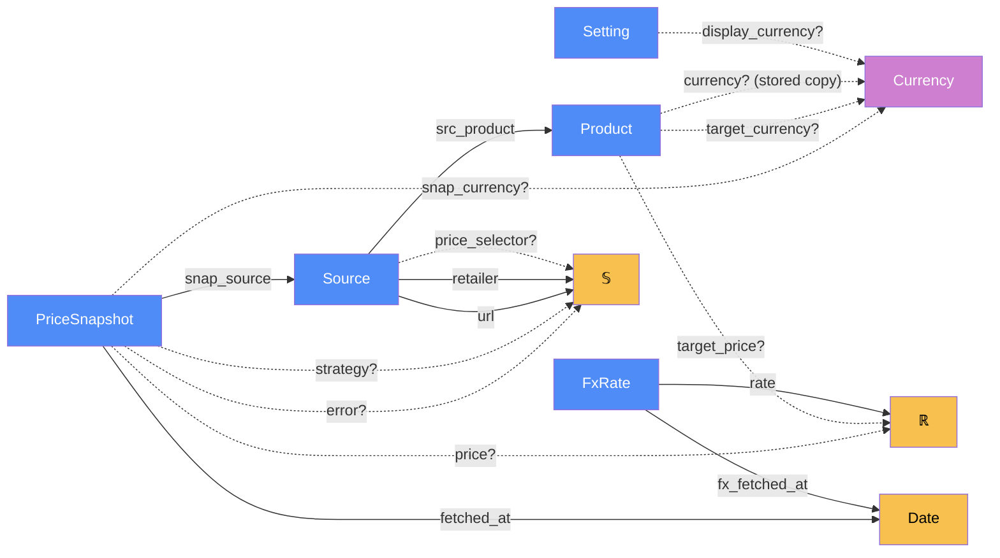

# Storage — categorical model

> Model-first (FRAMEWORK §2/§4). Intended specification for this component. The
> code realises it (see IMPLEMENTATION.md). Source of record: `app/database.py`.

## 1. Overview
The durable store: products, the shop listings (sources) tracking each one, the
price history of every fetch attempt, user settings, and the FX rate cache. It is
plain `sqlite3` with no ORM, one connection per call, in `data/app.db`.

## 2. Why
Modelling it as a category makes two things explicit that a schema can't. A
`PriceSnapshot` is a **sum**, success ⊕ failure, so a failed fetch is data rather
than a missing row. And `Product.currency` is a **stored copy of a deduced
morphism**, which needs a stated consistency mechanism (§5 "deduce, don't
store").

## 3. Core category

## 4. Morphism table
| Morphism | Signature | Partiality | Semantics |
| --- | --- | --- | --- |
| `src_product` | `Source → Product` | Total | the product this listing is one shop's offer of (ON DELETE CASCADE) |
| `snap_source` | `PriceSnapshot → Source` | Total | which listing was fetched (ON DELETE CASCADE) |
| `fetched_at` | `PriceSnapshot → Date` | Total | when the attempt was made (UTC ISO) |
| `price?` | `PriceSnapshot → ℝ` | Partial | present iff the fetch succeeded |
| `snap_currency?` | `PriceSnapshot → Currency` | Partial | the **shop's own** currency, never a converted one |
| `error?` | `PriceSnapshot → 𝕊` | Partial | present iff the fetch failed. Why the UI shows no price |
| `strategy?` | `PriceSnapshot → 𝕊` | Partial | which extraction strategy won |
| `target_price?` | `Product → ℝ` | Partial | the user's buy-at-or-below amount, as typed |
| `target_currency?` | `Product → Currency` | Partial | currency the target was typed in. NULL = "Shop's currency" = `currency?` |
| `currency?` | `Product → Currency` | Partial (stored copy) | the product's **primary currency**. Deduced as `snap_currency ∘ first successful snapshot`, stored write-once |
| `url`, `retailer` | `Source → 𝕊` | Total | the listing and its shop label |
| `price_selector?` | `Source → 𝕊` | Partial | user-supplied CSS selector for unknown shops |
| `display_currency?` | `Setting → Currency` | Partial | the "Show prices in" choice. Absent = as quoted |
| `rate` | `FxRate → ℝ` | Total | units of `quote` per 1 `base` (base is always USD) |
| `fx_fetched_at` | `FxRate → Date` | Total | age of the cached rate |

## 5. Functors
**Schema migration** is a functor from the v1 category (url and selector stored on
`Product`, snapshots keyed by product) to v2. It sends each v1 `Product` to a
`Product` plus one `Source`, and each v1 snapshot to a `PriceSnapshot` of that
source. It's identity on history, so no price is lost. Additive columns
(`target_currency`) extend the category and don't need a functor.

## 6. Composition rules
1. `price?(n) ≠ ∅ ⊕ error?(n) ≠ ∅`: every snapshot is exactly one of success or
   failure.
2. `snap_currency?` is whatever the shop quoted. Nothing ever writes a converted
   price (CLAUDE.md invariant 1).
3. `currency?(p)` is written once: set only while NULL, from the first successful
   fetch that reports a currency. It's a justified stored copy because it pins
   ranking even if that first shop later fails. The consistency mechanism is
   write-once.
4. A table rebuild runs with `foreign_keys = OFF` **and** `legacy_alter_table = ON`
   (invariant 8). Otherwise `DROP` of the renamed table cascades into migrated
   rows.
5. Order at startup: migrate v1 → apply `SCHEMA` → add missing columns. Indexes in
   `SCHEMA` reference v2 columns, and `ADD COLUMN` needs the table to exist.

## 7. Atoms owned (FRAMEWORK §4)
**Trn**
| `Trn` | `t_from → t_to` | Realising code |
| --- | --- | --- |
| `init_db` | `DbFile → DbFile(v2 + columns)` ⊸ | `database.init_db` |
| `add_product` / `add_source` / `add_snapshot` | `row → id` ⊸ | `database.add_*` |
| `set_product_currency` | `Product × Currency → Product` ⊸, write-once | `database.set_product_currency` |
| `get_*` reads | `id → row` | `database.get_*` |
| `get_setting` / `set_setting` | `key ⇄ value` | `database.get_setting` / `set_setting` |
| `save_fx_rates` / `get_fx_rates` | `FxRate* ⇄ table` | `database.save_fx_rates` / `get_fx_rates` |

**Loc**: `SQLite` (the file `data/app.db` on disk). Every caller's thread in
`ServerProc` opens its own connection.
**Trm**: `t_sql : ServerProc ⇄ SQLite`, carrying rows.
**Placements (§4.2)**: storage `Trn`s run on every thread that calls them: request
workers, the price-lookup pool (reads only), the scheduler thread, and the test
process. A connection per call is what makes that relation safe.

## 8. Bridges to other components (ports)
| Boundary morphism | Signature | Stored? | Semantics |
| --- | --- | --- | --- |
| `record` | `refresh → PriceSnapshot` | Stored | every refresh attempt lands here, success or failure |
| `read_views` | `Storage → web` | — | `web` reads products, sources and snapshots to build views |
| `rate_cache` | `fx ⇄ FxRate` | Stored | fx writes and reads its cache here |
| `display_setting` | `web ⇄ Setting` | Stored | the display-currency choice |

## 9. Coherence notes
- **Law 1 (placement honesty).** Analysis never reads SQLite directly: `web` reads
  rows over `t_sql` and hands them to `analysis`, so the data is materialised in
  process RAM before any `Trn` uses it.
- **Law 6 (runsAt is a relation).** Storage runs on many threads by design, and
  there's no process-wide connection to share.
