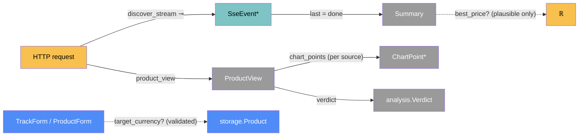

# Web — categorical model

> Model-first (FRAMEWORK §2/§4). Intended specification for this component. The
> code realises it (see IMPLEMENTATION.md). Source of record: `app/main.py`,
> `app/templates/`, `app/static/`.

## 1. Overview
The FastAPI app and its pages. It covers the dashboard, product page, discovery
page and form posts. The discovery **SSE stream** fills in shop sections as they
finish, looks up missing prices and sends a summary. It composes the other
components; its own logic is view-building plus the few rules that only make
sense at the UI boundary.

## 2. Why
This is where the `Trm`s to the user live: HTML, form posts and server-sent
events. Modelled as a category, the SSE stream is a **free monoid of a sum type**,
`(shop ⊕ price ⊕ note ⊕ error ⊕ done)*`. Two UI lies then become statements about
it: a spinner with no event ever coming, and a headline price from a doubtful
listing. The browser-side JS is deliberately a **dumb renderer**: every ranking
and conversion morphism is placed only on the server.

## 3. Core category

## 4. Morphism table
| Morphism | Signature | Partiality | Semantics |
| --- | --- | --- | --- |
| `product_view` | `Product → ProductView` | Deduced | comparison, series, verdict and target, via analysis + fx |
| `verdict` | `ProductView → Verdict` | Deduced | `analyze(series, target_in(...))` |
| `chart_points` | `PriceSnapshot* × Currency? × Currency? → ChartPoint*` | Deduced | one line, in one currency. Points that can't be expressed are dropped |
| `discover_stream` | `Query → SseEvent*` ⊸ | Total | one `shop` per searchable shop, then `price`s (≤3 at a time), then `done`. `error` if the browser can't start |
| `last = done` | `SseEvent* → Summary` | Total | outlier flags, best price, savings |
| `best_price?` | `Summary → ℝ` | Partial | only from `score ≥ 0.45 ∧ ¬price_suspect` |
| `target_currency?` | `Form → Currency` | Partial | `''` → NULL. Must be in `DISPLAY_CURRENCIES`, else HTTP 400 |
| `unavailable` | `DatabaseUnavailable → 503 page` | Total | any route whose database read fails answers with the outage page |
| `healthz` | `() → {app, database}` | Total | 200 when `db.ping` answers, else 503. Never names the backend, host or URL |
| `cron_daily` | `Request → Report` | Partial (secret) | 404 with no `CRON_SECRET`; 401 without the exact `Bearer` secret; else `refresh.daily_run` |
| `public_host` | `Request → Host` | Total | `x-forwarded-host` when present (behind the proxy), else `host`. What the cross-site guard compares against |

## 5. Functors
**Page-state functor (discover page).** Each shop section maps into the poset
`searching → {n results | refused | failed | not searched}`. Every stream ending
(`done`, `error`, dropped connection) must send every section to a terminal
element (`stopPending`). Unsearchable shops start terminal ("not searched — no site
search").

## 6. Composition rules
1. **Headline only from plausible listings** (invariant 7): `best_price?` ranges
   over `score ≥ MIN_HEADLINE_SCORE ∧ ¬price_suspect`.
2. **Server-side logic only.** The JS never ranks, converts or flags. It renders
   events, and it uses `textContent` for any shop-supplied text.
3. **No stuck spinner.** Every section reaches a terminal state on `done`, `error`
   or `onerror`.
4. **One currency per chart line**: the display currency, else the primary.
   Unknown or unconvertible points are dropped.
5. **Missing prices: at most 3 concurrent lookups**, each emitted as it lands.
   Refresh stays sequential.
6. **Target currency is validated at the boundary.** The client `<select>` limits
   the choices, and the server re-checks. It's one validation placed twice, as in
   §7.2.
7. **Chart colours** come from `--series-1..8`, in source-creation order, never
   cycled. A table dot matches its chart line.
8. **The current price is live-only.** `_latest_per_source` skips archived rows
   (`origin?` set), which count only in history and the verdict. Adding a product,
   tracking from discovery or adding a source queues an archive lookup
   (`history.schedule_backfill`) and never waits for it.
9. **An outage is never empty data.** `DatabaseUnavailable` from any route
   becomes one 503 page ("We couldn't load your data"), never "Nothing tracked
   yet". The page is standalone: `base.html` reads the signed-in user from the
   database, which is what just failed.
10. **`/healthz` reveals only two words.** `{"app": "ok", "database": "ok" |
    "unreachable"}`, no configuration.
11. **The cron route does nothing without the secret.** The comparison is
    constant-time (`hmac.compare_digest`). An unset secret makes the route a 404,
    so a misconfigured host can't run it.

## 7. Atoms owned (FRAMEWORK §4)
**Trn**: routes (`dashboard`, `product_detail`, `discover_page`, `discover_stream`,
`track_from_discovery`, `create_product`, `create_source`, `remove_*`,
`refresh_one`, `refresh_everything`, `set_display_currency`), plus view helpers
(`_product_view`, `_latest_per_source`, `_chart_points`, `_discovery_summary`,
`_target_currency`, `_candidate_row`). The JS renderers are `makeRow`,
`paintPrice` and `stopPending`.
**Loc**: `ServerProc` (uvicorn: request workers plus the price-lookup pool) and
`UserBrowser` (the page). When hosted, `ServerProc` runs on a `VercelInstance`,
and pages reach it through `VercelEdge`.
**Trm**:
- `t_page : ServerProc → UserBrowser`, carrying HTML
- `t_form : UserBrowser → ServerProc`, carrying form fields
- `t_sse : ServerProc → UserBrowser`, carrying `SseEvent*`
- `t_future : lookup pool → request worker`, carrying `PriceResult ⊕ ScrapeError`
- hosted only (owned by delivery): `t_edge`, HTTPS between `UserBrowser`,
  `VercelEdge` and `ServerProc`, which is why the guard reads the forwarded host;
  and `t_cron`, the host's daily trigger to `cron_daily`

**Placements (§4.2)**:
- target-currency validation runs in `UserBrowser` (the `<select>`) and in
  `ServerProc` (`_target_currency`);
- `fetch_price` runs in the lookup pool and on request workers.

## 8. Bridges to other components (ports)
| Boundary morphism | Signature | Stored? | Semantics |
| --- | --- | --- | --- |
| `outcome_stream` | `discovery → web` | — | `search_all` iterated inside `discover_stream` |
| `price_lookup` | `web → extraction.fetch_price` | — | in the pool of 3 |
| `views` | `analysis → web` | — | `compare_sources`, `best_price_series`, `analyze`, `target_in` |
| `convert` | `fx → web` | — | `_chart_points`, `_discovery_summary`, `_candidate_row` |
| `persist` | `web → storage` | Stored | products and sources from forms. Snapshots go via refresh |
| `refresh_now` | `web → refresh` | Stored | `create_product`, `refresh_one`, `refresh_everything` |

## 9. Coherence notes
- **Law 2 (transmission well-typing): advisory.** `SseEvent` is a sum type in
  intent, but its variants are built as ad-hoc dicts in `main.py` and parsed by
  hand in `discover.html`, with no single declaration (§5 "define each boundary
  once"). See suggestions.
- **Law 4:** the lookup pool never mutates `Candidate`s. Results cross back over
  `t_future` and are applied on the stream's thread.
